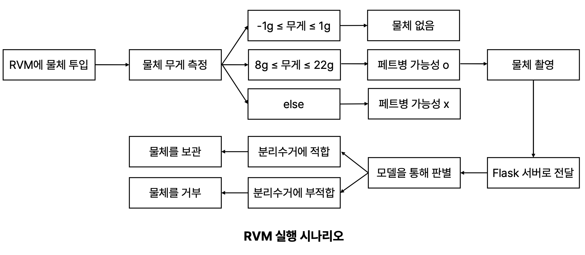

# Fiery: RVM for Korea: KHU Data Capstone Design Project

---

This repository is for Data Analysis Capstone Design Project


---

## Problem Definition

Since high-quality PET (PolyEthylene Terephtalate) recycled materials can be obtained from clear plastic bottles, Korea's recyclable material separation collection regulations, in this case regarding the collection of clear plastic bottles (or PET bottles), require that clear plastic bottles be separated from colored bottles and other plastics, and that they be disposed of with external and internal debris such as plastic labels, liquids, and residue removed.

One of the factors that hinders the recycling process in the existing system is the lack of personal control over recycling, as individuals do not strongly feel the need to recycle plastic bottles in the socially correct method.

This creates the need for an additional separation phase to separate other substances/materials that are mixed with the clear plastic bottle load. This leads to a waste of resources, money, and time. To solve these problems, this study aims to improve the PET bottle separation collection system by utilizing artificial intelligence technology and implementing an RVM system for domestic adoption.

---

## Approach, Experiment Result

### Classification Model

- ResNet-50
- EfficientNet b4

<table>
  <tr>
    <td><a href="link"></a></td>
    <td><a href="link"></a></td>
  </tr>
</table>

<br />

<table>
  <tr>
    <td><a href="link"></a></td>
    <td><a href="link"></a></td>
  </tr>
</table>

### Anomaly Dection

- Light U-Net

<table>
  <tr>
    <td><a href="link"></a></td>
    <td><a href="link"></a></td>
  </tr>
</table>

### Physical devices

- Arduino Electronic Scale
<figure class="half">  
<a href="link"></a>  
<a href="link"></a>  
</figure>
  <br />

Combining classification models(with Data Augmentation), outlier detection models(for clear Pet Detection), and Arduino scales

---

## Conclusion

**1. Purpose**

- Design and implementation of an RVM system that complies with domestic separate collection regulations
- Pursuit of accuracy and performance through a combination of artificial intelligence model and physical device

**2. Experiments**

- Performance verification of classification model and encoder-decoder model
- Improving efficiency and saving resources by using Arduino digital scales

**3. Results**

- EfficientNet performed better than ResNet
- The enhancement technique needs to be adjusted for the most effective details due to the dataset characteristics of ColorJitter
- U-Net needs further experimentation with practical coupling to RVM systems

---

## Project Structure

The directory structure: pytorch lightning hydra template from https://github.com/ashleve/lightning-hydra-template

```
├── .github                   <- Github Actions workflows
|
├── cam                       <- web cam, Flask, Arduino
│
├── configs                   <- Hydra configs
│   ├── callbacks                <- Callbacks configs
│   ├── data                     <- Data configs
│   ├── debug                    <- Debugging configs
│   ├── experiment               <- Experiment configs
│   ├── extras                   <- Extra utilities configs
│   ├── hparams_search           <- Hyperparameter search configs
│   ├── hydra                    <- Hydra configs
│   ├── local                    <- Local configs
│   ├── logger                   <- Logger configs
│   ├── model                    <- Model configs
│   ├── paths                    <- Project paths configs
│   ├── trainer                  <- Trainer configs
│   │
│   ├── eval.yaml             <- Main config for evaluation
│   └── train.yaml            <- Main config for training
│
├── data                   <- Project data
│
├── logs                   <- Logs generated by hydra and lightning loggers
│
├── notebooks              <- Jupyter notebooks. Naming convention is a number (for ordering),
│                             the creator's initials, and a short `-` delimited description,
│                             e.g. `1.0-jqp-initial-data-exploration.ipynb`.
│
├── scripts                <- Shell scripts
│
├── src                    <- Source code
│   ├── data                     <- Data scripts
│   ├── models                   <- Model scripts
│   ├── utils                    <- Utility scripts
│   │
│   ├── eval.py                  <- Run evaluation
│   └── train.py                 <- Run training
│
├── tests                  <- Tests of any kind
│
├── .env.example              <- Example of file for storing private environment variables
├── .gitignore                <- List of files ignored by git
├── .pre-commit-config.yaml   <- Configuration of pre-commit hooks for code formatting
├── .project-root             <- File for inferring the position of project root directory
├── environment.yaml          <- File for installing conda environment
├── Makefile                  <- Makefile with commands like `make train` or `make test`
├── pyproject.toml            <- Configuration options for testing and linting
├── requirements.txt          <- File for installing python dependencies
├── setup.py                  <- File for installing project as a package
└── README.md
```

<br>

## 🚀  Quickstart

```bash
# clone project
git clone https://github.com/muk-jjang/2024_DataCapstone_Recycling_Fiery.git

# [OPTIONAL] create conda environment
conda create -n myenv python=3.9
conda activate myenv

# install requirements
pip install -r requirements.txt
```
